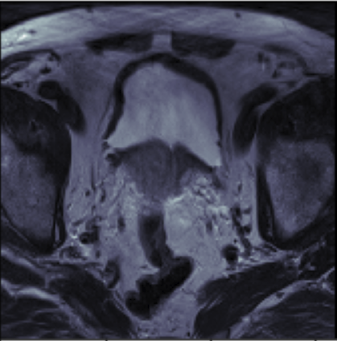
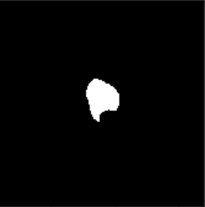
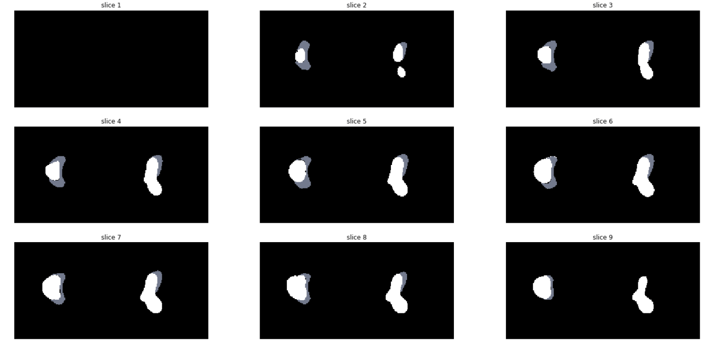
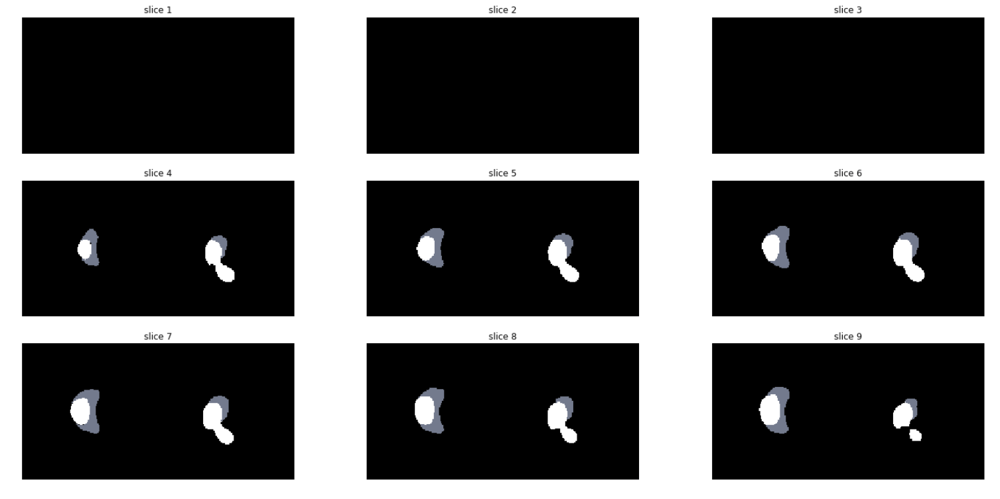
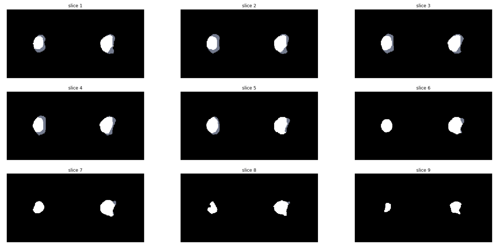
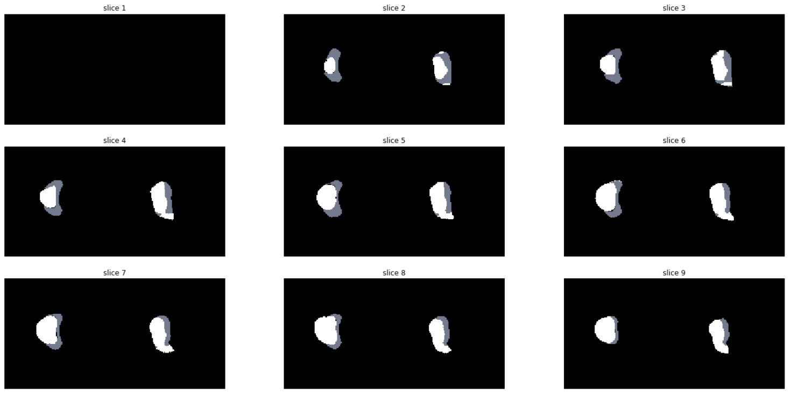

# 3D U-Net in TensorFlow

*Author: Daniel Homola*

__Main deliverables:__

- [Report](report/report.pdf)
- [Data exploration notebook](notebooks/data_exploration.ipynb)
- [Model exploration notebook](notebooks/model_exploration.ipynb)

### Overview

MRI scans from 70 patients were used to learn to automatically segment
the 3D volume of scans, and therefore spatially identify the outlines of
the central gland (CG) and peripheral zone (PZ).

The aim of this project was to quickly establish a benchmark model,
with minimal / lightweight code, only relying on core TensorFlow and
Python, i.e. without using Keras or other wrapper libraries.

__Dataset used__
- [NCI-ISBI 2013 Challenge: Automated Segmentation of Prostate Structures](https://wiki.cancerimagingarchive.net/display/DOI/NCI-ISBI+2013+Challenge%3A+Automated+Segmentation+of+Prostate+Structures)

__Original Paper__
- [3D U-Net: Learning Dense Volumetric Segmentation from Sparse Annotation](https://arxiv.org/abs/1606.06650)

### Data

__Prostate MRI scans with segmentation__

Objective: assign mutually exclusive class labels to each pixel/voxel.

Class labels: 0: background, 1: central gland , 2: peripheral zone

<table>
    <tr>
        <th>Input</th>
        <th>Shape</th>
        <th>Explanation</th>
        <th>Example</th>
    </tr>
    <tr>
        <td>X: 5-D Tensor</td>
        <td>(?, ?, 128, 128, 1)</td>
        <td>Resized (128, 128) MRI scans<br> with depth (between 15 and 40) <br>
        and a single channel. <br>Variable batch size.</td>
        <td></td>
    </tr>
    <tr>
        <td>y: 5-D Tensor</td>
        <td>(?, ?, 128, 128, 3)</td>
        <td>Resized (128, 128) segmentation<br> images with depth
        corresponding <br>to X and a three classes, i.e. 3 <br>channels one-hot
         encoded. <br>Variable batch size.</td>
        <td></td>
    </tr>
</table>

## Get Started

### Setup project

- Create new Python3 `virtualenv` (assumes you have `virtualenv` and
`virtualenvwrapper` installed and set up)
- Install dependencies.

```bash
mkvirtualenv --python=`which python3` unet3d
workon unet3d
make requirements
```

Additional helper functions can be explored with.

```bash
make help
```


### Download dataset

- The dataset was downloaded from [here](https://wiki.cancerimagingarchive.net/display/DOI/NCI-ISBI+2013+Challenge%3A+Automated+Segmentation+of+Prostate+Structures).
- As per the instructions, the training (60) and leaderboard (10)
subjects were pooled to form the train dataset (1816 scans in total).
- The test dataset consists of 10 patients with 271 scans.
- Unzip them and place them in data/raw.

### Explore and preprocess data

- In this notebook, we load in the MRI scans and their segmentations,
build a Dataset object for the train and test set.
- Then we check some basic stats of the datasets and visualise a few
scans.
- Finally, we carry out our preprocessing steps and save the train and
test datasets.


```bash
jupyter notebook "notebooks/data_exploration.ipynb"
```

## Build model

### Train and evaluate

Train model on train set and evaluate it on test set using the base
model architecture.

```bash
python src/main.py -model_dir models/base_model -mode train_eval
```

Do the same with same parameters but without batch normalisation.

```bash
python src/main.py -model_dir models/base_model_no_bn -mode train_eval
```


For more options:

```bash
python src/main.py -h

usage: main.py [-h] -model_dir MODEL_DIR [-mode MODE]
               [-pred_ix PRED_IX [PRED_IX ...]]

Train, eval, predict 3D U-Net model.

optional arguments:
  -h, --help            show this help message and exit
  -model_dir MODEL_DIR  Experiment directory containing params.json
  -mode MODE            One of train, train_eval, eval, predict.
  -pred_ix PRED_IX [PRED_IX ...]
                        Space separated list of indices of patients to
                        predict.
usage: main.py [-h] -model_dir MODEL_DIR [-mode MODE]
               [-pred_ix PRED_IX [PRED_IX ...]]

Train, eval, predict 3D U-Net model.

optional arguments:
  -h, --help            show this help message and exit
  -model_dir MODEL_DIR  Experiment directory containing params.json
  -mode MODE            One of train, train_eval, eval, predict.
  -pred_ix PRED_IX [PRED_IX ...]
                        Space separated list of indices of patients to
                        predict.
```

### Predict

Predict all 10 patients in test set with the trained base model and
save their predictions to model directory.


```bash
python src/main.py -model_dir models/base_model -mode predict - pred_ix 0 1 2 3 4 5 6 7 8 9

```

### Explore predictions

- Open the Jupyter notebook to have a look at test cases

```bash
jupyter notebook "notebooks/model_exploration.ipynb"
```

#### Example predictions with the `base model`



Ground truth is on left, prediction is on the right in each image.



#### Example predictions with the `deeper model`



Ground truth is on left, prediction is on the right in each image.




